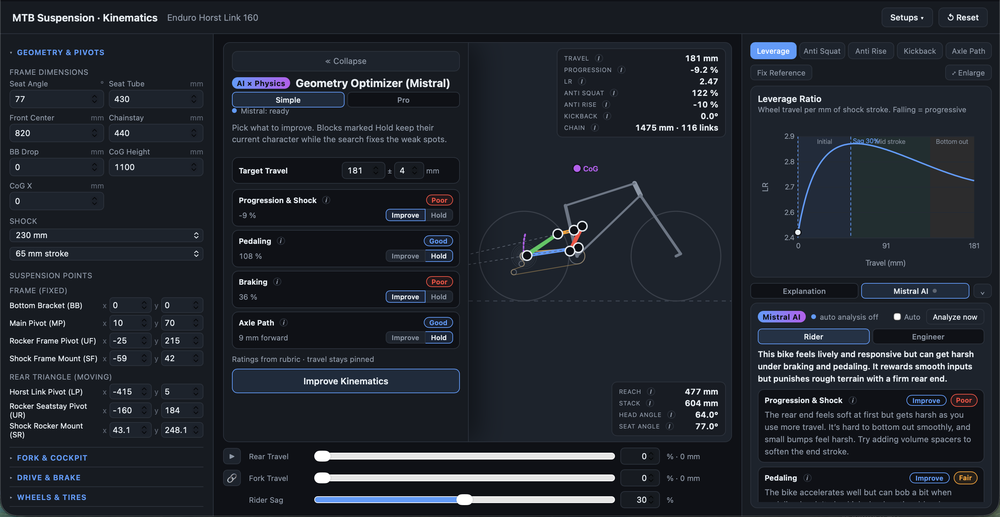

# MTB Suspension Kinematics + AI Optimizer

**A browser-based four-bar suspension solver with a Mistral-API optimization loop.**
The signature pattern: **the LLM proposes geometry, a local search refines it, and a
deterministic physics solver validates every iteration as ground truth.**

> *LLM proposes → local search refines → simulation validates.*

---

## ▶ Demo

<!-- Felix: drop the ~90s screen recording here.
     Easiest path: create a GitHub Release (or open an issue), drag the .mp4 in, and paste
     the resulting video URL on the next line. GitHub renders it inline. -->

**[ demo video — add link ]**

**[Try it live ➔](https://mtb-suspension-calculator-ai-optimi.vercel.app/)**

The deployment is password-protected — password available on request.

 <!-- Felix: add a screenshot to docs/ -->

---

## What it is

A from-scratch reimplementation of the core of the commercial tool **Linkage X3**: a
single-degree-of-freedom **Horst-link four-bar** solved through the full suspension travel,
producing the curves a frame engineer actually cares about:

- **Leverage ratio** & progression
- **Anti-squat** (with chain-line / instant-force-centre construction) and **anti-rise**
- **Pedal kickback** / chain growth
- **Axle path** and the live **instantaneous centre** over travel

Coordinate system: origin at the bottom bracket, +x forward, +y up, all lengths in mm.
The linkage is driven by the **rocker angle** (a monotone input that avoids dead points),
and each step solves the four-bar by circle–circle intersection, then derives the axle,
instant centre, anti-squat/anti-rise and the rest.

## The AI × physics loop

A geometry **optimizer** sits on top of the solver. You give it target curves (e.g.
*anti-squat at sag = 100 %, leverage progression = 25 %*) and it closes the loop:

```
 targets ─▶ ┌──────────────┐  pivot proposal   ┌────────────────┐
            │  Mistral LLM │ ────────────────▶ │  local search  │
            │  (warm start)│                   │ (pattern srch) │
            └──────────────┘                   └───────┬────────┘
                   ▲                                    │ candidate geometry
        metrics +  │                                    ▼
        history    │                          ┌──────────────────────┐
                   └───────────────────────── │  four-bar solver =    │
                       loss (ground truth)    │  the ONLY judge       │
                                              └──────────────────────┘
```

1. You set **target curves** + per-target priorities.
2. **Mistral** proposes new pivot coordinates — the strategic warm start. It's prompted to
   *"reason like gradient descent: see which past moves reduced the loss and continue."*
3. A **local pattern search** (per-axis coordinate descent) refines the proposal, each
   candidate re-scored against the solver.
4. The **deterministic four-bar solver scores every iteration as ground truth** — the LLM
   never "guesses into the void"; the physics confirms or rejects each move.
5. Invalid geometries are penalized hard; the best result can be applied to the bike.

On the default enduro preset the loss falls from **~0.14 to ~0** (anti-squat 100 % and
25 % progression both hit) within a couple of LLM iterations plus local refinement.

### Honesty note

The optimizer **runs without an API key** — it then falls back to the pure,
solver-validated local search (`optimizeLocal`). The LLM step is an *enhancement, not a
prerequisite*: it provides the strategic warm start that gets the search into a good basin
faster. With a key, the key stays **server-side** via a dev/serverless proxy (no `VITE_`
prefix), so it never lands in the client bundle.

## How it works, in code

The solver is the single source of truth. "Scoring" a geometry means *solving it and
measuring the deviation from the targets* — nothing about the LLM is trusted on its own:

```ts
// Solve the real kinematics, then measure deviation from the targets.
export function score(bike: Bike, sagPct: number, targets: OptTargets) {
  const result = solveBike(bike);                 // deterministic physics
  const m = metricsFromResult(result, sagPct);    // anti-squat, leverage, …
  if (!m.ok) return { metrics: m, loss: loss(m, targets) };          // invalid → hard penalty
  return { metrics: m, loss: loss(m, targets) + tendencyLoss(result, targets) };
}
```

The agentic loop: propose with the LLM, refine locally, **accept only if the solver's loss
actually improved.**

```ts
for (let i = 1; i <= iterations; i++) {
  // 1) Mistral proposes pivot coordinates (falls back to local search on any API error)
  const proposal = await mistralJSON<Proposal>(messages, { temperature: 0.2 });

  // 2) apply within per-point move radii, then refine against the solver
  const candidate = applyCoords(bestBike, proposal.points ?? {}, clamp);
  const refined   = localRefine(seed, sagPct, targets, clamp);

  // 3) the solver is the judge — accept only a real improvement
  const accepted = refined.metrics.ok && refined.loss < bestLoss - 1e-9;
  if (accepted) { bestBike = refined.bike; bestLoss = refined.loss; bestMetrics = refined.metrics; }
}
```

Each proposal is **clamped to a per-point move radius** around its start position, so the
LLM can't propose unbuildable jumps — the geometry stays physically sensible by construction,
not by trusting the model. If the API is unreachable or rate-limited, that iteration quietly
degrades to a pure local-search step rather than failing.

## Tech

TypeScript · React · Vite · Mistral API · Vercel (Edge middleware for access control).
Built with an AI-assisted workflow (Claude Code).

## Roadmap

- [x] Four-bar Horst-link solver with anti-squat/anti-rise, leverage, kickback, axle path
- [x] AI optimizer: targets → Mistral proposes → local search refines → **solver validates**
- [x] Offline mode (key-free solver search) + server-side key proxy
- [ ] **More target metrics & hard constraints** — target *bands* instead of point targets
      (e.g. "leverage 2.4–2.8"), packaging/collision penalties
- [ ] **Multi-objective / Pareto front** — return several trade-off candidates, not one
- [ ] **Surrogate model** to cut solver calls per LLM iteration (ML-accelerated search)
- [ ] **More kinematic layouts** — single pivot, twin-link/VPP, high-pivot with idler
- [ ] **Performance** — faster per-frame solve, smoother travel animation and live dragging
      on lower-end hardware
- [ ] **Bug fixes & stability** — tighten edge cases in the solver/optimizer as they turn up
- [ ] Save/load & compare geometries; benchmark vs. *Linkage X3*
- [ ] Spring/damper model (rate, sag, force curve)

## Context

This is a portfolio project demonstrating where **deep simulation meets AI deployment**:
turning an "interesting model" into a tool an engineer would actually open. The full source
is in a private repository; this repo presents the project (write-up, demo, architecture).
Happy to walk through the code and where I'd take it for an industrial-simulation use case.

— **Felix Woltering** · vehicle-development engineer (CFD/FEM/multi-physics) moving into AI
